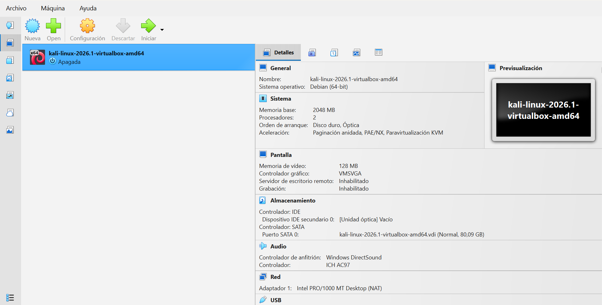
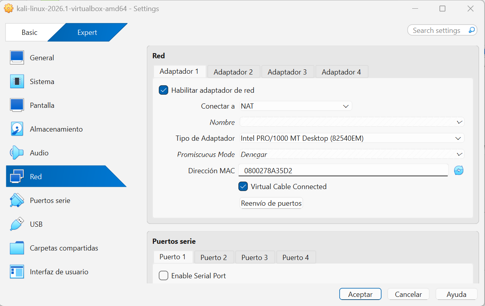
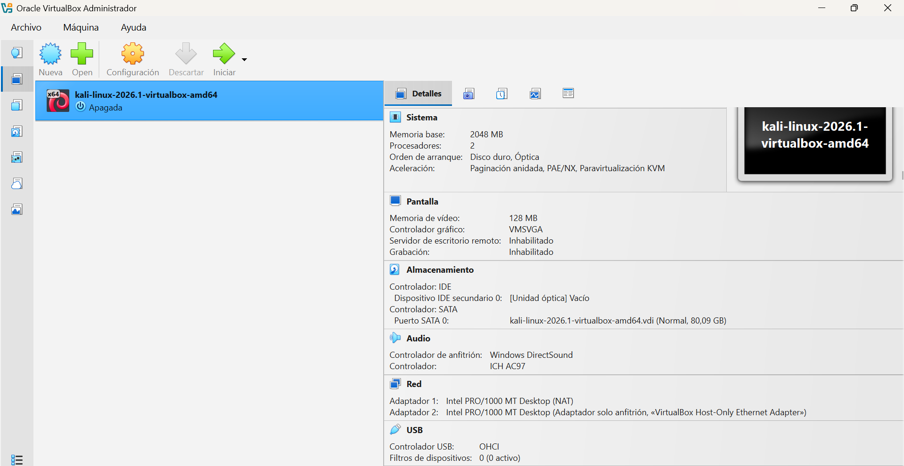
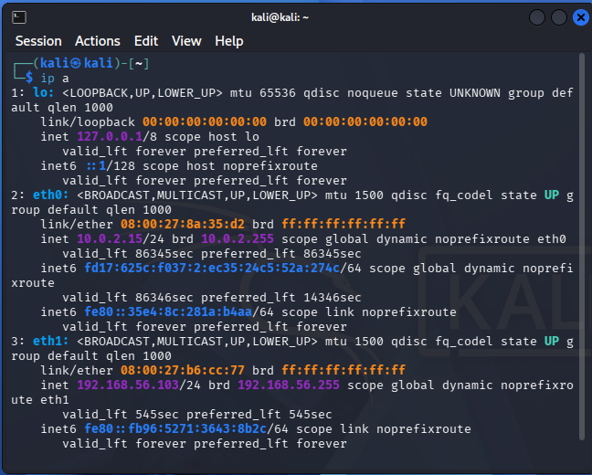

#  Home Lab: Entorno Virtual Seguro con Kali Linux

¡Bienvenido a mi proyecto de Laboratorio Local! En este repositorio documento el proceso completo de instalación, despliegue y segmentación de red para una máquina virtual **Kali Linux** utilizando **Oracle VM VirtualBox**.

El objetivo principal de este laboratorio es establecer una base sólida y totalmente segura para realizar pruebas de penetración y análisis de vulnerabilidades, garantizando el aislamiento de la red física local pero manteniendo el acceso a Internet para actualizaciones.

---

##  Arquitectura de Red del Laboratorio

Para este entorno se ha implementado una configuración de **doble adaptador de red**, combinando aislamiento estratégico y conectividad guiada:

1. **Adaptador 1 (NAT):** Permite que la máquina virtual tenga salida a Internet a través del equipo anfitrión (Host) para actualizar paquetes y herramientas (`apt update`), sin exponer la máquina virtual de manera directa a la red física externa.
2. **Adaptador 2 (Host-Only / Solo-Anfitrión):** Crea una red privada virtual exclusiva entre el sistema operativo anfitrión y la máquina virtual. Esto permite la interacción directa (SSH, transferencia de archivos, auditorías) de forma 100% segura y aislada del router de casa.

---

##  Proceso de Configuración y Verificación

A continuación, se detalla el paso a paso del despliegue mediante capturas de pantalla del entorno real:

### 1. Estado Inicial de la Máquina Virtual
Por defecto, al importar o crear la máquina virtual de Kali Linux, el sistema cuenta únicamente con una interfaz activa en modo NAT.

### 2. Configuración de los Adaptadores de Red
Se procedió a la edición de las preferencias de red de la máquina virtual para habilitar los dos canales de comunicación requeridos:

* **Paso A - Verificación del Adaptador 1 (NAT):** Asignado para la salida y resolución hacia redes externas.
  

* **Paso B - Activación del Adaptador 2 (Host-Only):** Se habilitó el segundo adaptador conectándolo a la interfaz virtual `VirtualBox Host-Only Ethernet Adapter`.
  

* **Vista Final del Hardware Virtualizado:** Resumen del aprovisionamiento del sistema, donde se confirma la correcta convivencia de ambas tarjetas de red.
  

---

### 3. Verificación de Direccionamiento IP en la Terminal de Kali Linux

Una vez iniciado el sistema operativo, se ejecutó el comando `ip a` para comprobar que el kernel de Linux reconoció y levantó de forma automatizada (vía DHCP interno) los direccionamientos correspondientes:

####  Análisis Técnico de las Interfaces Obtenidas:
* **`lo` (Loopback):** `127.0.0.1/8` ➔ Interfaz de bucle local interna del sistema operativo.
* **`eth0` (Interfaz NAT):** `10.0.2.15/24` ➔ Dirección IP dinámica asignada por VirtualBox para la navegación web y descarga de herramientas.
* **`eth1` (Interfaz Host-Only):** `192.168.56.103/24` ➔ Segmento privado estricto que utilizaremos para interactuar de forma segura con el Host principal u otras máquinas objetivo dentro del Lab.

---

##  Próximos Pasos (Roadmap del Laboratorio)
- [ ] Levantar un servidor SSH seguro en Kali Linux para administrar la máquina mediante la terminal del Host.
- [ ] Desplegar una máquina virtual vulnerable (ej. Metasploitable o OWASP Juice Shop) en el mismo segmento *Host-Only* (`192.168.56.X`) para simulaciones de ataque.
- [ ] Implementar reglas básicas de firewall con `iptables` / `ufw`.

---
*Proyecto desarrollado como parte de mi portafolio de aprendizaje enfocado en Ciberseguridad, Redes y Administración de Sistemas.*
